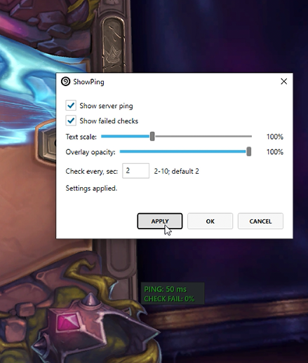

# ShowPing

ShowPing is a plugin for [Hearthstone Deck Tracker](https://github.com/HearthSim/Hearthstone-Deck-Tracker) that displays Hearthstone server latency in a separate in-game overlay.

It is intended for the Windows version of HDT.

## Features

- Shows Hearthstone server latency as `PING`
- Shows failed connection checks as `CHECK FAIL`
- Separate movable HDT overlay
- Overlay opacity setting
- Text scale setting from 75% to 150%
- Configurable check interval from 2 to 10 seconds

## How it works

ShowPing detects the current Hearthstone game server from the active Hearthstone process connection and measures TCP connection latency to that endpoint.

The plugin does not use ICMP ping. `PING` is shown as a simple user-facing label for the measured server connection latency.

## Configuration

Open:

`Options -> Tracker -> Plugins -> ShowPing -> Settings`

Available settings:

- Show server ping
- Show failed checks
- Text scale
- Overlay opacity
- Check interval

The overlay position can be moved using HDT's overlay unlock/move mode.

## Installation

Download the latest release from:

https://github.com/numbereleven-a/HDT-Show-Ping/releases/latest

Then install it using one of the standard HDT plugin methods:

### Drag and drop

1. Open `Options -> Tracker -> Plugins`
2. Drag the downloaded `.zip` or `.dll` into the plugins window
3. Restart HDT
4. Enable `ShowPing`

### Manual install

1. Extract the release archive into `%appdata%\Hearthstone Deck Tracker\Plugins`
2. Restart HDT
3. Enable `ShowPing` in `Options -> Tracker -> Plugins`

If the plugin does not appear, right click `ShowPing.dll`, open `Properties`, and click `Unblock`.

## Download

